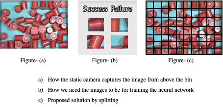

# Teal-Titan-Automation
### A custom Convolutional Neural Network Architecture based solution Machine Automation for Teal, Titan

## Introduction
This project aims at replacing vibratory bowl feeders in industry production lines with a vision guided robot. This project we use VGR in the form a cobot arm equipped with an external camera and using the input/feedback from the camera, we uses various algorithms to help the cobot pick the component from the bin successfully.

## Assumptions
We assume that the bin is continuously been filled as the objects are removed from it. Although the refilling need not necessarily be equal to the number of components removed from the bin, we assume that bin gets the filled by 15 ± x, where |x| < 5 after 15 components are filled. This way we are making it more randomised and not controlling the setup too much.

We’ve also assumed the component for phase 1 to be a simple, uniform and almost symmetrical component to avoid complications. Having the component simple in the initial phase, allows us to understand any prerequisites and methods to tackle basic obstacles for future phases.


## Challenges
As of today, most of the industry standard solutions consisting a Vision Guided Robot, involve a 3D camera for the vision system. 3D camera allows the measure the z-axis component/position which otherwise isn’t available without external sensors on using 2D Camera. To decrease the overhead cost we decided to implement this with only a 2D static camera. However in order to tackle it, we used the cobot’s built in pressure sensor using the vacuum grip to detect the object post which the bot tries to pickup instead of moving downwards towards the bin. We could’ve also used external IR/Ultrasonic Sensors to receive the z-axis data.

We challenged ourselves by using a static camera over the bin, against the industry standard of having a static camera over the bin as well as a camera attached to the arm of the robot in order to make it more accurate while guiding it to the location, as well as easier image capture possible for training.

We split the images into ’n’ number of pieces, where ’n’ depends on the size of the components and we assign each piece to a coordinate.
By using this we avoid necessity of two cameras and thus reducing overhead costs.
